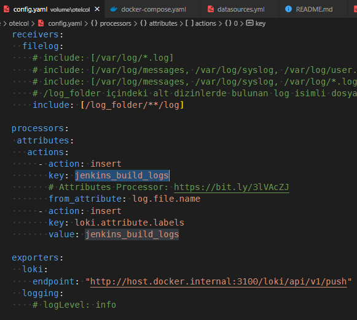
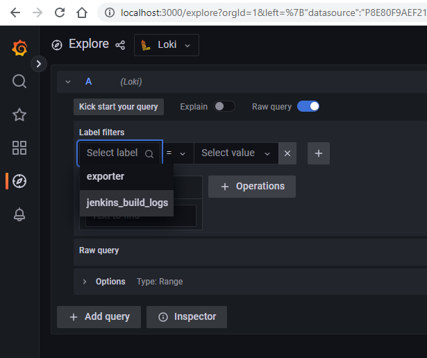
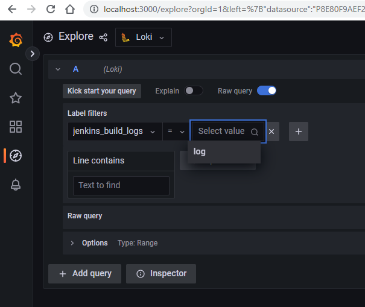
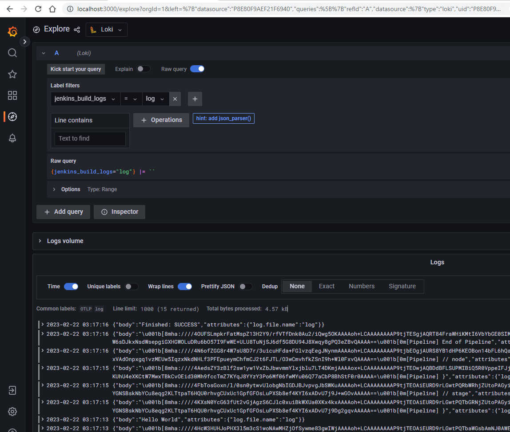

# Burada Neler Oluyor?

Jenkins derleme günlüklerini ayrı bir günlük toplayıcısına yönlendirmek istiyoruz.

Bu iş için:
- Jenkins üstünde görevleri (job) çalıştıracağız
- Jenkins görevlerinin günlüklerini toplamak için OpenTelemetry (sidecar olarak çalışacak)
- günlükleri depolayacağımız sunucu LOKI
- günlükleri görüntüleyeceğimiz sunucu GRAFANA


## Grafana'da Loki Kaynağındaki Günlük Kayıtlarını Sorgulamak

OpenTelemetry'nin ayarlarında jenkins_build_logs olarak tanımlandığı için kayıtları bu etiket içinde göreceğiz:









## GRAFANA Gösterge Panelleri (Dashboard)
```
/usr/share/grafana/conf/provisioning/dashboards/
```

## GRAFANA'ya DATASOURCE Vermek

Grafana veri kaynaklarını aşağıdaki dizinlerde tutar:
```
/usr/share/grafana/conf/provisioning/datasources/
/etc/grafana/provisioning/datasources/
```

#### GRAFITI
 https://grafana.com/docs/grafana/latest/administration/provisioning/#example-data-source-config-file

#### LOKI
 https://grafana.com/docs/grafana/latest/datasources/loki/#provision-the-data-source

#### JAEGER
 https://grafana.com/docs/grafana/latest/datasources/loki/#loki-data-source# jenkins-loki-grafana-OpenTelemetry
